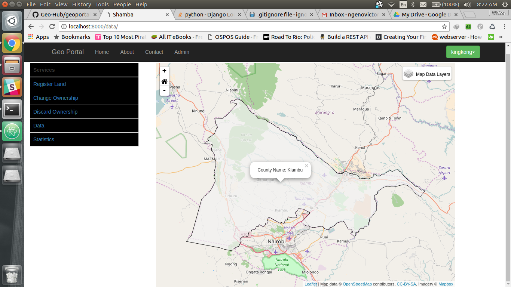
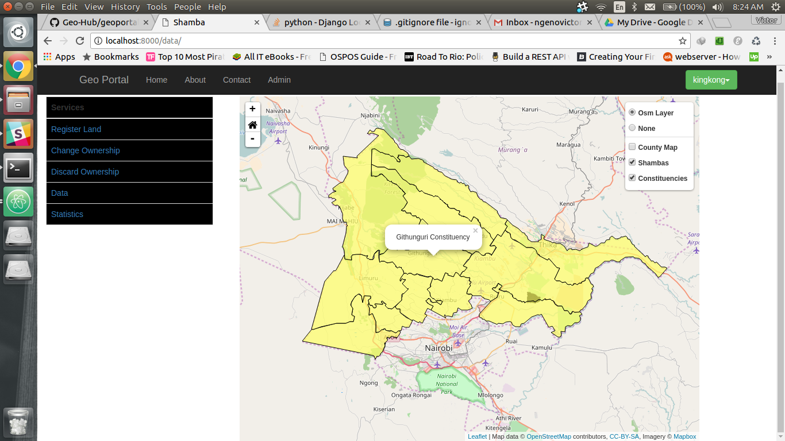
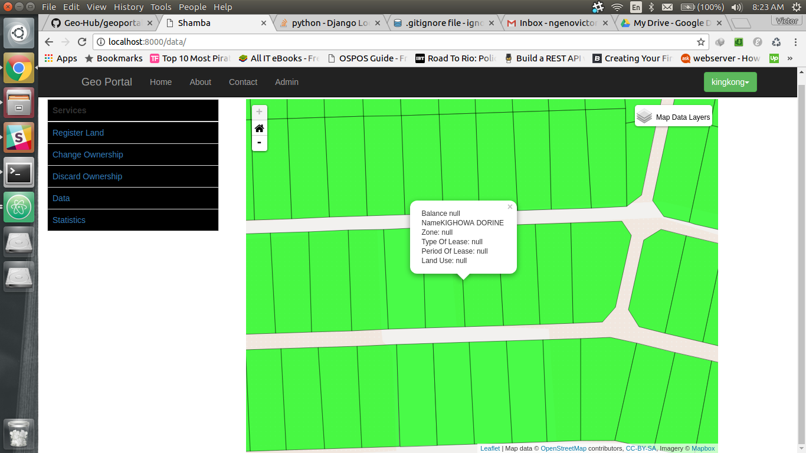

# GeoPortal

## The GeoHub Team

### _Presented at the 2015 Jkuat Tech Expo_

#### _Won most popular award_

The app is up at [https://geohub-geoportal.herokuapp.com](https://geohub-geoportal.herokuapp.com)

See the [Geo part here](https://geohub-geoportal.herokuapp.com/data/)

##### _Setup Instructions_

1. Create a python 2.7 virtual environment
2. Activate the virtual environment
3. Access project directory  **geoportal**
4. Install modules from **requirements.txt**
5. Uncomment out _settings.py_ database settings to reflect a db in your postgresql dbms with postgis extension
6. Run migrations
7. Create superuser
8. Copy [data folder](https://drive.google.com/open?id=0B3BfzupGx1AFNzRLUGRnanlkWk0) to main app directory
9. Run the following scripts in _manage.py shell_
    * > load.py
    * > loadcons.py
    * > loaddiv.py
    * > loadloc.py
    * > loadsubloc.py
10. Run the app _manage.py runserver_

#### Contributors (Team GeoHub)

1. [Ng'eno Victor](https://github.com/ngenovictor)
2. [Nombu Murage](https://github.com/nombumurage)
3. Sophia Njeri
4. [Thomas Muteti](https://github.com/Thom03)
5. James Mwangi

#### Screen Shots

1. Kiambu County loaded on the data page
    
2. Kiambu constituency loaded on the data page
    
3. Farms (Shambas) loaded on the data page
    